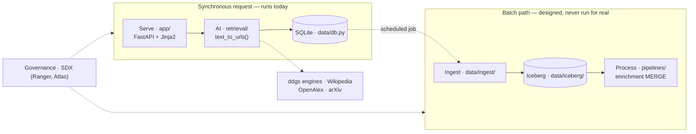

# Cloudera Blueprint: URLvestigia

**A governed URL table**

## Table of Contents

- [Overview](#overview)
- [Demo](#demo)
- [Use Case](#use-case)
- [Key Features](#key-features)
- [Quickstart](#quickstart)
- [Architecture / Software Components](#architecture)
- [Target Audience](#target-audience)
- [Repository Structure](#repository-structure)
- [Prerequisites](#prerequisites)
- [Hardware Requirements](#hardware-requirements)
- [Documentation](#documentation)

## Overview

URLvestigia turns a natural-language question into a persisted, reviewable table of
source URLs: ask a question, get ranked links, and keep the query, provider, engines,
region, and time window that produced them — so a search becomes an artifact instead of
an activity. It is for **researchers and analysts** who need discovery captured rather
than merely performed, and for the **architects and engineers** who will fork it as a
starting point. **Why Cloudera:** the value here is the record, not the search, and a
search record earns its keep only when it is governed, queryable, and shared — SQLite
serves one analyst, Iceberg on Cloudera Data Warehouse serves an organisation, and SDX
governs both without the application changing. It is the reference Cloudera Blueprint:
one thin capability wired across all five layers of the standard stack (Ingest →
Lakehouse → Process → AI → Serve), small enough to read in an afternoon, free to run
with no API keys or accounts, and started on a laptop with one command — with
**retrieval, Serve, and local SQLite storage complete and running today, and the CDP
platform layers written against the same schema but dry-run only.**

## Demo

No Reprise walkthrough has been recorded yet, so `reprise_link` in
[`METADATA.yaml`](METADATA.yaml) is intentionally empty.

Until one exists, [`docs/EXAMPLE.md`](docs/EXAMPLE.md) is the evidence you can read
**without cloning anything**: a single question followed end to end — the search call,
the rows it writes, the SQLite → Iceberg load plan, the enrichment `MERGE`, and the
Ranger policy that governs the result — with the actual SQL and output printed at each
hop. It takes about 20 minutes on a laptop if you do decide to run it, and it is the
fastest way to judge whether the blueprint does what this page claims.

## Use Case

Research that starts with "find me the sources on X" is done in a browser and lost in a
browser. Tabs close, links live in someone's history, and which query produced which
results is unrecoverable — so the search cannot be reviewed, repeated, or handed over.
In regulated discovery this is not an inconvenience but a finding: systematic reviews
and pharmacovigilance already require a defensible record of *how* a search was run, and
that record is today reconstructed by hand, if at all.

**The business outcome is a governed, queryable search record.** Every URL carries the
query and the options that produced it, so a search can be reproduced or audited months
later. URLs returned by more than one corpus are kept as independent corroboration
rather than collapsed as noise. The store is governable through SDX like any other
table, which is what makes the record admissible inside an existing data-governance
regime instead of alongside it.

**Industry alignment is horizontal.** The need appears wherever discovery has to be
defensible; the sharpest fit is regulated research — systematic review,
pharmacovigilance, competitive and patent scanning. Full reasoning and the qualification
scorecard: [`docs/BUSINESS_CASE.md`](docs/BUSINESS_CASE.md).

## Key Features

- **One question, four corpora.** Reach the open web, an encyclopedia, the scholarly
  record, and preprints through a single call, without learning four APIs or writing
  per-source code.
- **A record that cannot overstate itself.** Each search is stored with exactly the
  options that were applied. Options a corpus does not support are recorded as `NULL`
  rather than as the value the form happened to carry, so the record never claims a
  filter that never ran.
- **Corroboration instead of duplicates.** A URL found by more than one corpus is
  retained as independent confirmation — a stronger signal than the same link twice from
  one engine.
- **A search survives a throttled engine.** Web queries go to four engines at once and
  pool their results, so one blocked or rate-limited engine no longer empties the
  search.
- **Three ways in, one record.** A dashboard for people who do not write code, a CLI
  that pipes, and a Run All notebook — all writing through the same
  [`data/record.py`](data/record.py), so the NULL rule above cannot hold in one
  interface and quietly lapse in another.
- **Nothing to buy, nothing to build.** No API keys, no accounts, no build step, and no
  front-end toolchain. It runs on a laptop with one command, and every page works with
  JavaScript disabled.
- **Demo failures found beforehand.** `make doctor` probes every corpus and every engine
  individually with timings, so a blocked network is discovered at your desk rather than
  in front of a customer.
- **Links only, never page content.** The blueprint records where an answer was found
  and never retrieves or stores the page itself, which keeps the governance surface
  small by construction.

<a id="quickstart"></a>

## Quickstart / Guide

Everything here runs on a laptop, with nothing provisioned.

1. **Clone the repository.**

   ```bash
   git clone https://github.com/masonjung/URLvestigia && cd URLvestigia
   ```

2. **Install and run.**

   ```bash
   make install     # runtime + test dependencies
   make dev         # → http://127.0.0.1:8000/
   ```

3. **Before a live demo,** confirm this machine reaches every corpus:

   ```bash
   make doctor      # probes each provider and each engine, with latency
   ```

4. **Verify the build.**

   ```bash
   make test        # 346 passing, 13 skipped (the live tier, opt in with --live)
   ```

**Without `make`** — the Makefile needs bash, so on Windows without Git Bash or WSL run
the same commands directly:

```bash
python -m pip install -r app/requirements.txt -r tests/requirements.txt
python -m uvicorn app.server:app --reload --port 8000
python scripts/doctor.py
python -m pytest tests -q
```

### From the terminal

No server, no browser. The same governed rows, and URLs on stdout so they pipe:

```bash
python scripts/cli.py search "GLP-1 receptor agonist adverse events" --provider openalex
python scripts/cli.py search "iceberg compaction" --backend duckduckgo --timelimit y -n 25
python scripts/cli.py list --urls
python scripts/cli.py export --format csv --out review-appendix.csv
python scripts/cli.py doctor
```

`search` writes the URLs to stdout and everything else — which options this corpus
applied, which it ignored, where the row landed — to stderr, so
`search "..." > urls.txt` leaves a file of URLs and nothing else. Exit codes
distinguish the cases a script has to tell apart: `0` results, `1` the search failed,
`2` usage, `3` the corpus answered and had nothing. Full reference:
[`scripts/README.md`](scripts/README.md).

### From a notebook — no terminal at all

[`quickstart.ipynb`](quickstart.ipynb) is Run All, top to bottom, from a cold clone.
It checks what this network reaches, picks a corpus that answered, runs a search,
shows the record, queries it in SQL, and writes the export — every step in the
notebook itself, so nothing has to be repeated in a shell. It installs whatever the
kernel is missing as it goes, and a blocked network gets a named diagnosis rather
than a traceback. The dashboard is the one thing it does not start; that is
`make dev`, above.

```bash
make install-notebook    # or: pip install -r requirements-notebook.txt
make notebook            # or: jupyter lab quickstart.ipynb
```

### In a Cloudera AI Workbench session

The same notebook is the intended path in a **Cloudera AI (CML) session** — start
one with the JupyterLab editor on a Python 3.11 runtime, open `quickstart.ipynb`,
and Run All. 2 vCPU / 4 GiB is ample; there is no model here and no GPU is used.

Two things differ from a laptop, and the notebook handles both:

- **No port, no browser.** The notebook starts no server: section 4 renders the
  store in the notebook itself, read-only, and section 6 writes the appendix — so a
  session where `CDSW_APP_PORT` is already spoken for is no obstacle. The dashboard
  is a separate process either way, deployed as a Cloudera AI Application or run
  with `make dev`, and where it binds is decided in
  [`app/hosting.py`](app/hosting.py): every interface in a session, where the
  browser is outside the container, and loopback on a laptop, because this app has
  no authentication — see [Prerequisites](#prerequisites).
- **Egress.** A datacenter IP is the profile the public web engines block hardest, so
  the `ddgs` provider may return nothing from a session even though it works on a
  laptop. This is a measurement, not a defect: the preflight names which engines
  answered, and the notebook falls back to Wikipedia, OpenAlex, or arXiv — keyless
  APIs that do not block on IP reputation. See
  [`governance/model_cards/urlvestigia-retrieval.md`](governance/model_cards/urlvestigia-retrieval.md).

**As a library:**

```python
from urlvestigia import text_to_urls

text_to_urls("best python web scraping libraries", max_results=10)
```

Options: `provider` (`"ddgs"` · `"wikipedia"` · `"openalex"` · `"arxiv"`),
`max_results`, `region`, `safesearch`, `timelimit`, and `backend`. URLs come back
deduplicated, in rank order. The support matrix is in
[`retrieval/README.md`](retrieval/README.md). To search *and record* in one call, use
[`data/record.py`](data/record.py) instead — `record.run("...", provider="arxiv")`
returns the URLs and writes the row.

<a id="architecture"></a>

## Architecture / Software Components

A synchronous request path that runs today, and a batch path written against the same
schema that has never been executed against a real cluster.



| Layer | Component | Cloudera service | State |
| --- | --- | --- | --- |
| Serve | FastAPI + Jinja2 dashboard, server-rendered | Cloudera AI Application | runs locally |
| AI | `text_to_urls()` metasearch over four corpora | Cloudera AI Workbench | runs locally |
| Ingest | SQLite → Iceberg loader | Cloudera Data Engineering | dry run only |
| Lakehouse | `raw_searches`, `raw_search_urls`, `curated_urls` | Iceberg on CDW | DDL never applied |
| Process | URL normalisation and enrichment (Spark) | Cloudera Data Engineering | dry run only |
| Governance | Ranger policies, Atlas lineage, model card | SDX | never imported |

**Dependencies and security review scope.** Runtime dependencies are FastAPI, Uvicorn,
Jinja2, and the `ddgs` metasearch library; everything else is the Python standard
library, and there is no front-end build chain to audit. Outbound traffic goes to four
public search engines plus the Wikipedia, OpenAlex, and arXiv APIs — search endpoints
only, never the result URLs themselves. Data at rest is a single SQLite file holding
queries and links, never page content. Inbound, the Serve layer binds to localhost and
carries no authentication today; read [Prerequisites](#prerequisites) before exposing
it. Every platform target prints what it *would* do and changes nothing without an
explicit `--execute`. Design decisions and the request path in full:
[`docs/ARCHITECTURE.md`](docs/ARCHITECTURE.md).

## Target Audience

- **Solution architects** evaluating the Cloudera Blueprint standard — *no coding
  required to assess it*; the repository is deliberately small enough to read in an
  afternoon, and every directory carries a README explaining what belongs there.
- **Data and ML engineers** who need a small, complete repository to fork — *comfortable
  Python and SQL*; `make new VERTICAL=healthcare USECASE=readmission-risk` clones the
  layout into a fresh blueprint. Extending storage to Iceberg additionally needs Spark
  and CDP familiarity.
- **Researchers and analysts** who need discovery captured, not just performed —
  *no programming at all*; the dashboard is the entire interface, and the resulting
  table is the deliverable. If you would rather work in a notebook,
  [`quickstart.ipynb`](quickstart.ipynb) runs top to bottom without an edit, and
  `python scripts/cli.py export --format csv` gets the record out as an appendix.

## Repository Structure

| Path | Description |
| --- | --- |
| `app/` | FastAPI + Jinja2 dashboard (Serve layer) |
| `retrieval/` | Search providers and the eval notebook (AI layer) |
| `data/` | SQLite dev store, schema, Iceberg DDL, and the loader |
| `pipelines/` | Cloudera Data Engineering (Spark) enrichment jobs |
| `infra/` | Deployment configs — CDP CLI provisioning and Terraform |
| `.cicd/` | Deployment scripts and the GitLab pipeline definition |
| `governance/` | SDX policies, data classification, model card |
| `docs/` | Extended documentation — architecture, business case, gates, worked example |
| `tests/` | Unit, data-quality, and retrieval-eval tiers |
| `scripts/` | `cli.py` terminal interface, `doctor.py` preflight, `kernel.py` notebook installs, `new-accelerator.sh` scaffold |
| `.github/` · `.gitlab/` | GitHub Actions, issue and merge-request templates |
| `quickstart.ipynb` | Run All: preflight, one recorded search, the record in HTML and in SQL, and the export |
| `requirements-notebook.txt` | Jupyter, kept out of `make install` |
| `METADATA.yaml` | Catalog metadata for the Cloudera blueprint website |
| `Makefile` | `make help` lists every target |

## Prerequisites

- **Python 3.11** (the version CI runs) and `git`.
- **bash** for the `make` targets — Git Bash or WSL on Windows, or the direct commands
  above.
- **Outbound internet.** Searches call public engine pages and the Wikipedia, OpenAlex,
  and arXiv APIs. Behind a proxy, set `DDGS_PROXY` or `HTTPS_PROXY`.
- **No API keys, accounts, or credentials of any kind** for everything that runs today.
- **CDP entitlement and the `cdp` CLI / Terraform** only for the platform layers, none
  of which has been executed.

**Before serving this anywhere but `127.0.0.1`:** there is no authentication and no CSRF
protection — `/clear`, `/delete/{id}`, `/dedupe`, and `/store` act on an unauthenticated
POST — and `ingress_cidrs` defaults to `0.0.0.0/0`. Note also that query text leaves the
environment: searches go to third-party public endpoints with no API key and therefore
no data-processing agreement, which must be raised with any customer whose data cannot
leave. See [`governance/DATA_CLASSIFICATION.md`](governance/DATA_CLASSIFICATION.md).

## Hardware Requirements

| Deployment | Minimum |
| --- | --- |
| Launchable / demo (everything that runs today) | 2 vCPU, 4 GB RAM, <1 GB disk — a laptop |
| Production / enterprise (target, never provisioned) | CDP `LIGHT_DUTY` Data Lake; AI Workbench on `m5.xlarge`; CDE workers on `m5.2xlarge`, autoscaling 0–4. No GPU — there is no model here. |

Defaults live in [`infra/terraform/variables.tf`](infra/terraform/variables.tf). Size up
from measured load.

## Documentation

- [`docs/EXAMPLE.md`](docs/EXAMPLE.md) — one search across all five layers, ~20 minutes
- [`docs/ARCHITECTURE.md`](docs/ARCHITECTURE.md) — the stack, the request path, the
  decisions worth defending
- [`docs/BUSINESS_CASE.md`](docs/BUSINESS_CASE.md) — problem, Cloudera fit, scorecard
- [`docs/GATES.md`](docs/GATES.md) — what "done" means at each of the six phases
- [`governance/DATA_CLASSIFICATION.md`](governance/DATA_CLASSIFICATION.md) — retention
  and third-party disclosure
- [`governance/model_cards/urlvestigia-retrieval.md`](governance/model_cards/urlvestigia-retrieval.md)
  — intended use, out of scope, known limitations
- Every directory carries its own `README.md` explaining what goes there and which
  Cloudera tool automates it.

Licensed under [Apache 2.0](LICENSE).
